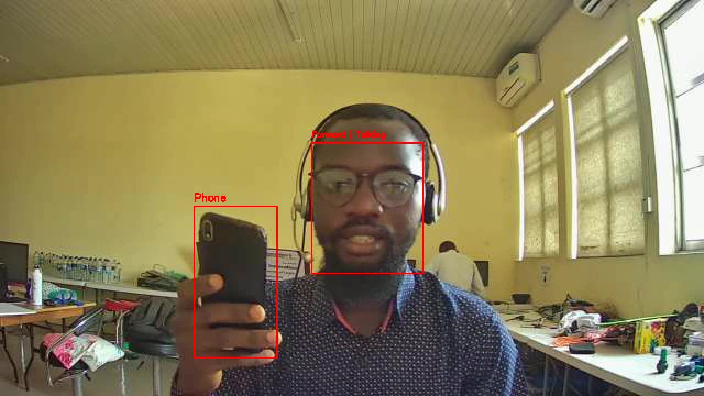

# 🕵️‍♂️ Examination Proctoring Aid System

A light-weight proctoring system based on computer vision to detect anomalies during examinations. The system uses facial landmark tracking (MediaPipe), head pose estimation (MediaPipe) and object detection (YOLO) to monitorstudent behaviour and flag anomalous activities like:

- Looking left or right
- Speaking
- Presence of mobile phones

---

## 🚀 Features

| Feature                            | Emoji | Description                                     |
| ---------------------------------- | ----- | ----------------------------------------------- |
| Real-time face tracking            | 👤📍  | Tracks students face using MediaPipe           | 
| Gaze direction detection           | 👀🧭  | Detects if the student looks left/right        |
| Bounding box color-coded alerts    | 🟥🟩  | Red = Anomaly, Green = Normal                        |
| Mobile phone detection (YOLO)      | 📱🎯  | Detects mobile phones                          |
| Works on CPU                       | 🧠💻  | Runs efficiently without GPU                   |
| Multiple face detection            | 👥❗   | Detects presence of more than one face        |
| Alert system (future)              | 🚨🔔  | Trigger warnings on suspicious activity        |
| Video recording/logging            | 🎥📝  | Record examination sessions for review         |
| Web accessibility (future)         | 🌐🔗  |   Accessible through the web using either PC or smartphones          |

---

## ⚙️ Installation

### 📦 Prerequisites

Make sure you have Git and Python 3.7+ installed and set up.

### 📥 Clone This Repository

To get started with this project on your local machine, run:

```bash
git https://github.com/usmanadaudu/exam-anomaly-detection.git
cd exam-anomaly-detection
```

### 🔧 Install Dependencies

Install neccesary libraries

```bash
pip install -r requirements.txt
```
---

## 💻 Usage

```bash
python main.py
```

---

## 📤 Outputs

### 🎥 Live video feed
A real-time analyzed video feed will be displayed. The live feed will be a mirrored version of the footages.

### 📹 Recorded footage
The processed footages will be saved as a video named `processed_footage.mp4` in the main directory. The saved video will be a non-mirrored version.

### 📊 Sample Output

> 

---

## 🔒 Disclaimer

This tool is a **proof of concept** and should not be considered a fully secure proctoring solution. It is meant for educational and research purposes only.

---

## ✍️ Author

**Usman Daudu**  
Data Scientist  
📧 LinkedIn: [Usman Daudu](https://www.linkedin.com/in/usmanadaudu/)
🔗 GitHub: [@usmanadaudu](https://github.com/usmanadaudu)